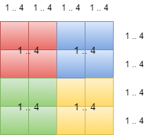
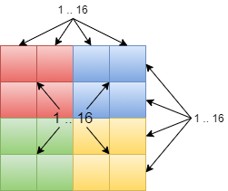

# Sudoku_set
Simple Sudoku solver based on bit sets. For educational purposes.
Made with C and [Bit set library](https://github.com/DanArmor/Bit_set_C)

## Input data forman
First number is length of one side of the grid - n. And next n^2 numbers - grid. If number is 0 - it is empty cell.

## Main idea
The common problem of the simplest sudoku solvers is necessity to check ony by one each cell in row, column and box. So here we can avoid that by using sets for recognition, what cells we have already filled.

We can represent sudoku grid like this:

As we can see - each row, column and box may contain a set of numbers from 1 to n (for our example - 4). When we fill some cell with number - we add that number in corresponding sets. If we try to fill cell with number, but the number is already in one of sets - that invalid turn, and we need to try another number.

But 3n sets for sudoku grid is too many, that's why we can represent each collection of sets (for rows, for columns and for boxes) as one big set for each collection:
1. Rows
2. Columns
3. Boxes

We can go futher and make a REALLY big set-all-in-one, but it makes our code less clear, I think.

And now our grid looks like this:

For rows and columns the index in set is: `number + i*n` where `i` is `num of column or row`, and `n is length of one side of grid`.

---

And for boxes is ("/" equals "mod") : `number + (i / sqrt(n)) * n * sqrt(n) + (j / sqrt(n)) * n`. 

---

From `1 to n *sqrt(n)` there are top sqrt(n) boxes, next n*sqrt(n) boxes are from `n*sqrt(n) to n*2*sqrt(n)` and so on

And, to check, is our current turn is valid - we don't need to check all of cells in row, column and box - just calculate 3 indexes and check their entry into sets. 

---
## Algorithm

  1. While we have cells to go and current cell is filled - we increasing indexes of row and column. Otherwise - skip
  2. If there is no cell to go - turn on flag, print solution and stop processing of sudoku
  3. For each number from 1 to n AND there is no solution yet DO:
      1. If current combination of row, column and number is NOT valid - try next number. If it IS valid:
          * Add necessary elements to sets of grid.
          * Increase param k.
          * Next step ot the solution(pause this turn and start new from 1.)
          * Decrease param k.
          * Delete elements from sets
  4. If you have tried every number - just clear the cell
